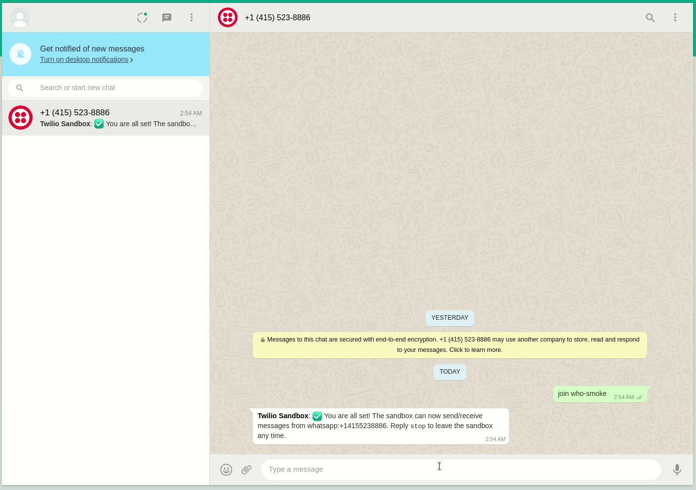

# WhatsApp Chatbot Using Flask and Twilio

### Overview
A chatbot is a computer program designed to simulate conversation through voice commands or text chats (or both) with human users, especially over the internet. The level of intelligence among chatbots vary immensely, some (like the one used here) are very basic, while others can be very sophisticated by employing machine learning algorithms and artificial intelligence in order to attain near human-level conversation.

This application makes use of the [Flask](https://flask.palletsprojects.com/en/1.1.x/) framework and [Twilio API for WhatsApp](https://www.twilio.com/whatsapp) while working with Python.

To use it, ensure you have an active phone number and WhatsApp installed in your smartphone. Create an account with Twilio then register your smartphone with your account(see technical details for more info). You will need to send the code given for your smartphone as a message to the number provided in your account.



### Tools Used
* Python for programming
* Flask web framework
* Twilio API for WhatsApp
* Ngrok for temporary provision of Twilio URL
* Quatable API
* Cat as a Service API

### Features
* Real-time automated WhatsApp responses
* Multi-device access to application provided by Ngrok URL

### Contributors
* [Gitau Harrison](https://github.com/GitauHarrison)

### Deployed Application
* [Simple WhatsApp Chatbot](https://simple-whatsapp-chatbot.herokuapp.com/)

### Testing

To successfully test this application, there are two requirements you will need:
* A smartphone with WhatsApp installed, with an active phone number
* A Twilio Account. You can create [a free Twilio account now](https://www.twilio.com/try-twilio?promo=7fB3Je).

If you do not want to create your own project but would prefer to use this project, you will need to do the following:

1. Clone this repo:

```python
$ git clone git@github.com:GitauHarrison/whatsapp-chatbot-using-flask-and-twilio.git
```
2. Create and activate your virtual environment:

```python
$ mkvirtualenv whatsapp-chatbot
```

3. Install useful dependencies

```python
(whatsapp-chatbot)$ pip3 install -r requirements.txt
```
4. Run the application:

```python
(whatsapp-chatbot)$ flask run
```

Once your application is running, you can access your localhost on http://127.0.0.1:5000/. Additionally, if you look carefully in your terminal, you will see * Tunnel URL: NgrokTunnel: "https://4209c9af6d43.ngrok.io" -> "http://localhost:5000"

The HTTP value may be different from the one shown here because I am using the free tier package of ngrok. 

5. Ensure you are still logged in to your Twilio Account: 

    - Go back to the [Twilio Console](https://www.twilio.com/console), 

    - Click on [Programmable Messaging](https://www.twilio.com/console/sms/dashboard), then on [Settings](https://www.twilio.com/console/sms/settings), and finally on [WhatsApp Sandbox Settings](https://www.twilio.com/console/sms/whatsapp/sandbox). 

    - Copy the `https://` URL from the ngrok output and then paste it on the “When a message comes in” field.

    - Our chatbot is exposed in the URL ending with `/bot`. You will need to append `/bot` to the `https://` URL from `ngrok`. 

    - Be certain to set your request method to `HTTP POST`.

    - Click the Save button to apply your changes

From your smartphone, or the WhatsApp Web App, you can try sending messages with sentences including the words 'cat' and 'quote'. Also, try excluding those words.

### References

1. If you do not know how to make a flask application, learn how to do that [here](https://gitauharrison-blog.herokuapp.com/personal-blog).

2. This application makes use of `ngrok`. Learn how to incorporate it in your flask app [here](https://gitauharrison-blog.herokuapp.com/ngrok).

3. If you would like to know how to create your own WhatsApp chatbot from scratch using flask and twilio (rather than simply running this application), [read more here](https://github.com/GitauHarrison/notes/blob/master/simple_whatsapp_chatbot.md).